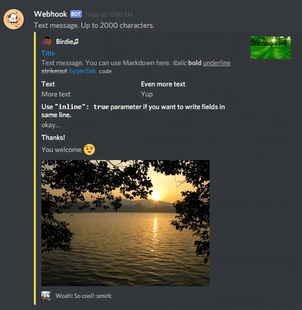

# Structure of Webhook

Before using Webhooks you have to know the structure. All elements listed here are *optional* but request body should contain `content`, `embeds` or attachments, otherwise request will fail.

* `username` - overrides the predefined username of the webhook
* `avatar_url` - overrides the predefined avatar of the webhook
* `content` - text message, can contain up to 2000 characters
* `embeds` - array of embed objects. In comparison with bots, webhooks can have more than one custom embed
  * `color` - color code of the embed. You have to use Decimal numeral system, not Hexadecimal. You can use [SpyColor](https://www.spycolor.com/) for that. It has decimal number converter.
  * `author` - embed author object
    * `name` - name of author
    * `url` - url of author. If `name` was used, it becomes a hyperlink
    * `icon_url` - url of author icon
  * `title` - title of embed
  * `url` - url of embed. If `title` was used, it becomes hyperlink
  * `description` - description text
  * `fields` - array of embed field objects
    * `name` - name of the field
    * `value` - value of the field
    * `inline` - if true, fields will be displayed in the same line, 3 per line, 4th+ will be moved to the next line
  * `thumbnail` - embed thumbnail object
    * `url` - url of thumbnail
  * `image` - embed image object
    * `url` - image url
  * `footer` - embed footer object
    * `text` - footer text, doesn't support Markdown
    * `icon_url` - url of footer icon
  * `timestamp` - ISO8601 timestamp (`yyyy-mm-ddThh:mm:ss.msZ`)
* `tts` - makes message to be spoken as with `/tts` command
* `allowed_mentions` - object allowing to control who will be mentioned by message
  * `parse` - array, can include next values: `"roles"`, `"users"` and `"everyone"`, depends on which decides which mentions work. If empty, none mention work.
  * `roles` - array, lists ids of roles which can be mentioned with message, remove `"roles"` from `parse` when you use this one.
  * `users` - array, lists ids of roles which can be mentioned with message, remove `"users"` from `parse` when you use this one.

## Webhook example

```json
{
  "username": "Webhook",
  "avatar_url": "https://i.imgur.com/4M34hi2.png",
  "content": "Text message. Up to 2000 characters.",
  "embeds": [
    {
      "author": {
        "name": "Birdie♫",
        "url": "https://www.reddit.com/r/cats/",
        "icon_url": "https://i.imgur.com/R66g1Pe.jpg"
      },
      "title": "Title",
      "url": "https://google.com/",
      "description": "Text message. You can use Markdown here. *Italic* **bold** __underline__ ~~strikeout~~ [hyperlink](https://google.com) `code`",
      "color": 15258703,
      "fields": [
        {
          "name": "Text",
          "value": "More text",
          "inline": true
        },
        {
          "name": "Even more text",
          "value": "Yup",
          "inline": true
        },
        {
          "name": "Use `\"inline\": true` parameter, if you want to display fields in the same line.",
          "value": "okay..."
        },
        {
          "name": "Thanks!",
          "value": "You're welcome :wink:"
        }
      ],
      "thumbnail": {
        "url": "https://upload.wikimedia.org/wikipedia/commons/3/38/4-Nature-Wallpapers-2014-1_ukaavUI.jpg"
      },
      "image": {
        "url": "https://upload.wikimedia.org/wikipedia/commons/5/5a/A_picture_from_China_every_day_108.jpg"
      },
      "footer": {
        "text": "Woah! So cool! :smirk:",
        "icon_url": "https://i.imgur.com/fKL31aD.jpg"
      }
    }
  ]
}
```

## And how it looks


